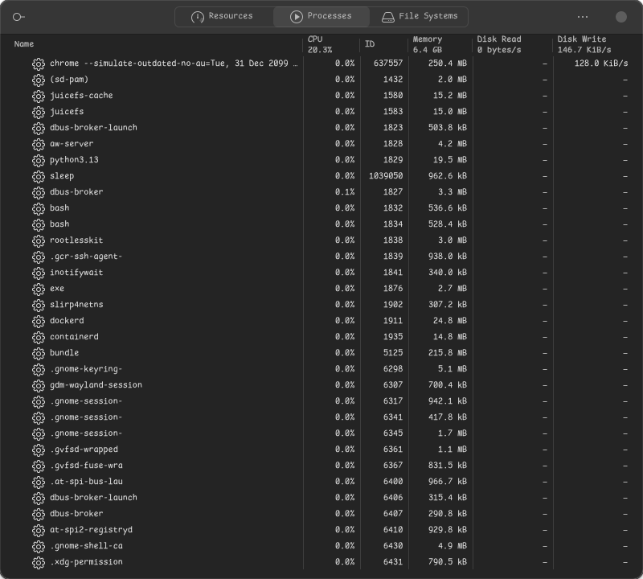
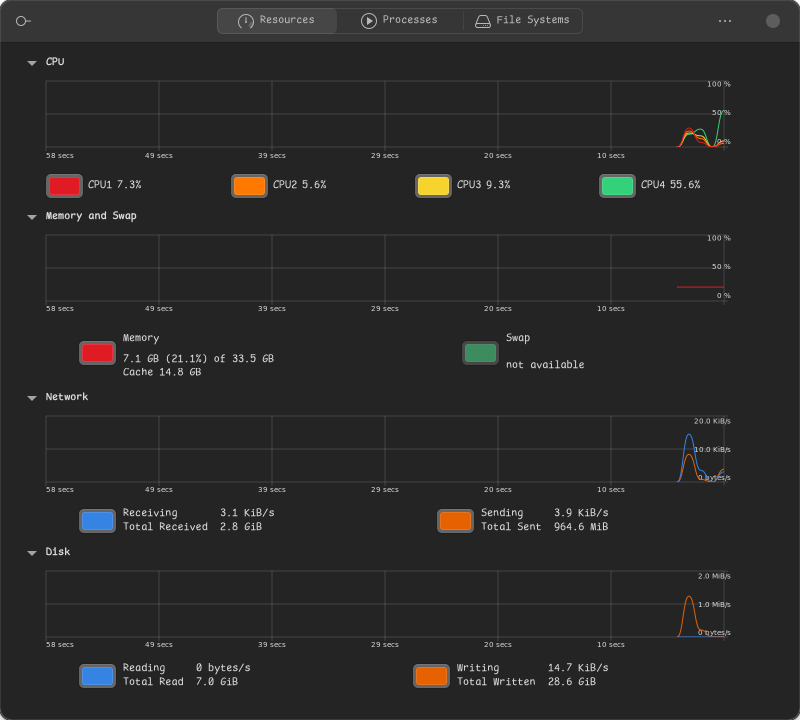

# GNOME System Monitor — Ruby port

A port of [gnome-system-monitor](https://gitlab.gnome.org/GNOME/gnome-system-monitor)
to Ruby, GTK4 and Libadwaita. The C/C++ original lives on this fork's `main`
branch and is the specification; this branch is the port.

Everything the original does, it does here: the Resources charts, the process
table with its twenty-seven columns and its dependency tree, the File Systems
list, the per-process dialogs, and Preferences. It reads the same GSettings
schema and the same translations as the C build, so the two are
interchangeable from a user's point of view.




## Running it

```sh
direnv allow        # or: nix develop
bundle install
make run
```

`make test` runs the lot: RuboCop, the unit tests, and the headless UI drive.

## What it reads

The original gets its numbers from libgtop. There is no Ruby binding for
libgtop, and on Linux libgtop is itself a `/proc` reader — so this reads
`/proc` directly, keeping libgtop's field names, units and arithmetic:

| Shown as | Read from |
|---|---|
| process list, state, nice, start time | `/proc/PID/stat` |
| virtual, resident and shared memory | `/proc/PID/statm` |
| writable memory | `/proc/PID/smaps_rollup`, falling back to `smaps` |
| disk read and write | `/proc/PID/io` |
| control group, systemd unit and session | `/proc/PID/cgroup`, `/run/systemd/sessions` |
| CPU, memory, swap | `/proc/stat`, `/proc/meminfo` |
| network | `/proc/net/dev`, filtered by `/proc/net/route` and `if_inet6` |
| disk throughput | `/proc/diskstats`, whole disks only |
| filesystems | `/proc/mounts` plus `GFileInfo`'s filesystem attributes |
| memory maps, open files | `/proc/PID/smaps`, `/proc/PID/fd`, `/proc/net/*` |

Two deliberate differences, both noted where they happen in the code:

- **X Server Memory** is always zero. The original fills it from the XRes
  extension, which reports nothing under Wayland either.
- **Open Files** shows a socket's peer as an address rather than a hostname.
  The original resolves the name with a blocking DNS lookup on the UI thread;
  the port skips that and keeps the `/etc/services` port name, which costs
  nothing.

Changing another user's process needs root, and gets it the way the original
does: try the operation, and on a permission error re-run it under `pkexec`
through one of the three small helpers in `bin/`, authorised by
`data/gnome-system-monitor.policy`. The original ships no polkit action for
Set Affinity — its own helper could never have been authorised — so this adds
one.

## Layout

```
bin/gnome-system-monitor   the app
bin/gsm-*                  the privileged helpers, run under pkexec
lib/gnome_system_monitor/  everything else
data/                      gschema, desktop and appstream metadata, icons, policy
po/                        upstream's catalogues, reused unchanged
test/                      unit tests and the headless UI drive
```

The model layer — `proc_fs.rb`, `proc_files.rb`, `system_stats.rb`,
`units.rb` — has no GTK in it and is tested directly. The views follow the
declarative memoized-widget style described in `.claude/skills/ruby-gtk`.

## One thing worth knowing before you touch the tables

A GTK4 list view binds a row to a cell once and never looks at it again.
Upstream keeps its cells live with `GtkBuilderListItemFactory` `<binding>`
elements, which follow the property; neither of the two equivalents is usable
from these Ruby bindings:

- `gtk_expression_bind` segfaults once list items start being recycled.
- Holding a cell widget — the list item or its child — past the end of the
  bind callback corrupts the Ruby heap.

`test/test_binding_limits.rb` reproduces both. What the port does instead is
render each row's text into string properties on the row, then tell the model
which rows changed so the view binds them again; `lib/gnome_system_monitor/list_refresh.rb`
is that, and the comment at the top of it is the long version.

## Licence

GPL-2.0-or-later, as upstream. See `COPYING`.
